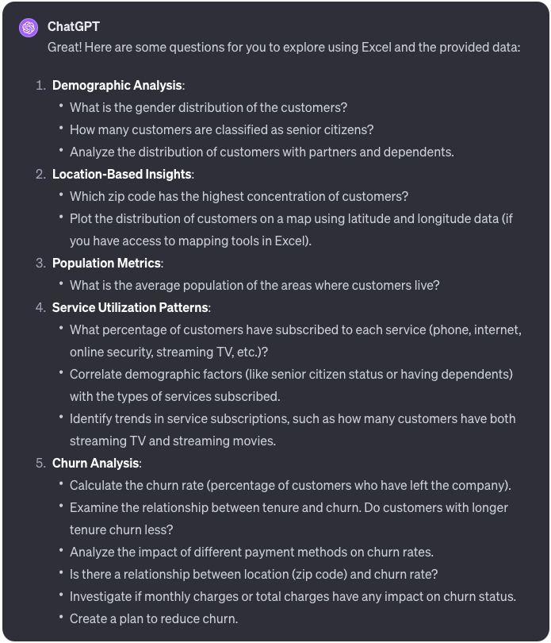

# Projects:

### **[Excel_TelcoChurn ](https://github.com/jeyao1/jeffyao_portfolio/raw/main/misc/Excel_TelcoChurn.xlsx)** (01/2024)
> **Summary:** In my ‘SQL_Telco’ project, I cleaned a dataset and exported it to a CSV file for analysis in Excel. I uploaded this dataset to ChatGPT with the specific aim of generating a diverse set of data analysis questions. As illustrated below, these questions cover a wide range of topics, including customer demographics, service utilization patterns, and churn trends. It is important to note that ChatGPT’s role was exclusively in producing questions. All calculations, tests, dashboards, and interpretations in this project are done by me.

**Tools Used**:    

 

 
 

### **[mpg_project ](https://github.com/jeyao1/jeffyao_portfolio/blob/main/mpg_project.ipynb)** (11/2023)
> **Summary:** I analyzed a dataset from UCI’s MI Repo to assess factors that may have influenced fuel economy improvements (MPG increase) from 1970 to 1981. Upon removing rows with invalid values (NULL/NaN), I found that removing them did not compromise data quality. I used a correlation matrix to confirm expected relationships among variables, such as MPG’s correlation with the number of cylinders and horsepower. Following data cleaning and validation, I used Tableau to generate charts to observe trends among specific groups and car distribution over time, particularly focusing on changes across different cylinder types. The analysis suggests that MPG improvements are largely due to a consumer shift towards 4-cylinder cars. However, no variables in the dataset conclusively explain this improvement. The data indicates a general trend of MPG improvement over time, likely linked to the decline of 8-cylinder cars, but the exact factors remain unidentified.

**Tools Used**:    

<iframe src="mpg_project.html" width="107%" height="500" allowfullscreen scrolling="yes" style="border: 1px solid black; transform: scale(0.90); transform-origin: top left;"></iframe>
 
 

### **[SQL_telco ](https://github.com/jeyao1/jeffyao_portfolio/blob/main/SQL_telco/SQL_telco.ipynb)**(11/2023)

> **Summary:** This project specifically demonstrates SQL proficiency using 5 tables from IBM’s BI-tool, Cognos. I created an ERD in MySQL to visually represent the tables and their relationships by way of Primary and Foreign keys. Additionally, I wrote three exploratory queries involving JOINS. Below each table, I’ve detailed the data cleaning and validation processes.
 
**Tools Used**:   

<iframe src="SQL_telco/SQL_telco.html" width="107%" height="500" allowfullscreen scrolling="yes" style="border: 1px solid black; transform: scale(0.90); transform-origin: top left;"></iframe>

 
 
 

    

